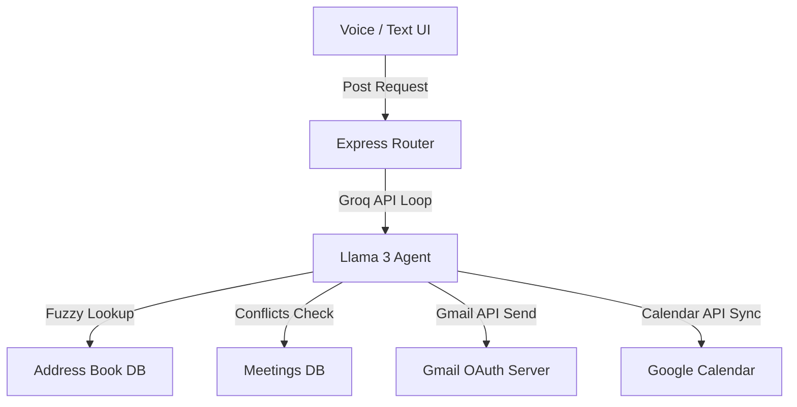

# Personal Mail Assistant - Project Presentation Slides

This document is formatted as a project slide presentation. You can use these slides to showcase the project architecture, features, and technical details.

---

## 💻 Slide 1: Title & Project Overview

### **PERSONAL MAIL ASSISTANT**
*An AI-Powered Scheduling & Email Communication Companion for Professionals*

- **Purpose**: Automate meeting scheduling, mail dispatch, calendar synchronization, and daily briefings.
- **Goal**: Offload scheduling tasks using natural language voice and text commands.
- **Highlight**: Spelling-tolerant voice contact resolution & strict zero-hallucination agent guards.

---

## ⚠️ Slide 2: The Core Problems We Solve

### **1. Scheduling Overload**
Manual calendar entries, meeting links creation, invitee listing, and email notifications consume valuable time.

### **2. Voice Recognition Spelling Errors**
Voice transcribers mishear phonetic names (e.g. transcribing "Sreedhar" as "Sridhar"), failing typical exact-match lookup searches.

### **3. AI Agent Hallucinations**
Standard LLMs frequently fabricate email addresses (e.g., guessing `name@domain.com`) when a contact search returns empty results.

---

## 🏗️ Slide 3: System Architecture



- **Monorepo Separation**: React client separated from TypeScript backend.
- **Dynamic Prompt Seeding**: Injecting DB contact ground truth on every LLM agent request.

---

## ⚡ Slide 4: Key Application Features

- **AI Voice Console**: Web Speech API integration with an HSL gradient animated audio feedback visualizer.
- **Fuzzy Contact Resolver**: Tokenized Jaro-Winkler matching on name and email parts.
- **Email Parser & Scanner**: Scans Gmail inbox, extracts meeting parameters, and imports them in 1-click.
- **Conflict Prevention**: Mandatory database-level checks preventing double-bookings.
- **Daily Briefing Summary**: Quick Markdown orientations rendered on the home dashboard.

---

## 🔍 Slide 5: Address Book & Fuzzy Matching Engine

### **The Tokenized Resolver**
Splits contacts' names and emails on spaces, dots, dashes, underscores, and `@`.
```typescript
const tokens = name.split(/[\s\._\-@]+/);
```
Enables matching the query `"Sridhar"` against the email domain token `sreedhar` in `9f.sreedhar.haridasu@gmail.com`.

### **Matching Gates & Rules**
- **Exact Match (1.0)**: Proceeds directly.
- **Single Fuzzy Match (>= 0.88)**: Proceeds while notifying the user.
- **Ambiguity / Multi-match (< 0.88)**: Prompts user with choice.

---

## 🛠️ Slide 6: Technical Stack

- **Frontend**: React 19, TypeScript, Vite, Vanilla CSS.
- **Backend**: Express (Node.js), TypeScript, PostgreSQL (`pg` pool).
- **AI Core**: Groq SDK, Llama 3 models (`llama-3.3-70b-versatile` / `llama-3.1-8b-instant`).
- **APIs**: Gmail API, Google Calendar API (v3), Web Speech Recognition API.

---

## 🚀 Slide 7: Setup & Local Running

### **Backend Setup**
```bash
cd backend
npm install
npm run init-db   # Create tables & seed mock data
npm run dev       # Starts on http://localhost:5000
```

### **Frontend Setup**
```bash
cd frontend
npm install
npm run dev       # Starts on http://localhost:5173
```
*Note: Make sure to configure the `.env` files with database credentials, Groq API Key, and Google OAuth Client ID.*
